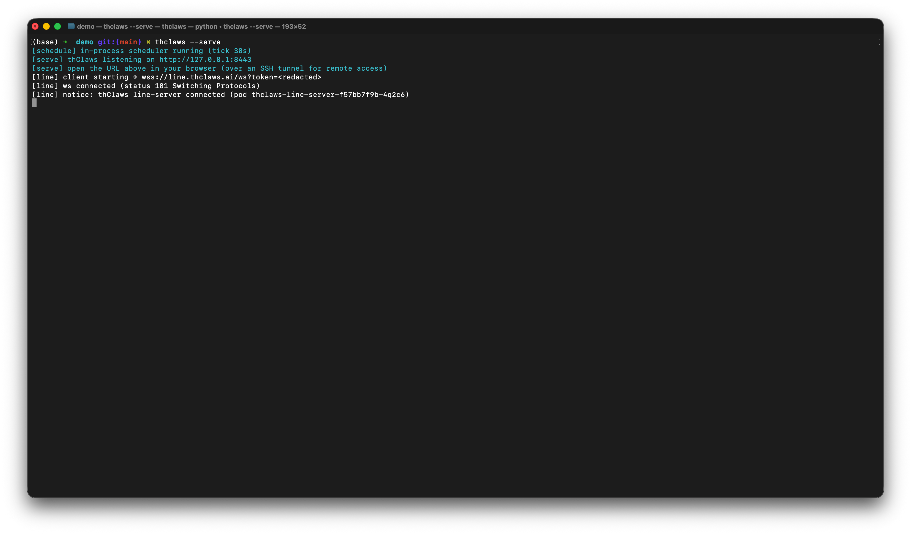

# Chapter 3 — Working directory & running modes

thClaws is **rooted at a directory**. Every file tool — read, write, edit,
glob, grep, bash — is restricted to that directory and its descendants.
Pick it carefully: too broad (like `/`) and you lose the sandbox; too
narrow and the agent can't see what it needs.

## First-launch setup {#first-launch-setup}

Opening the desktop GUI for the first time runs you through two
modals in sequence, then drops you into the main window. Subsequent
launches skip the second modal — your keychain / `.env` choice is
remembered.

### 1. Pick a working directory

Every launch (not just the first) starts with a modal asking where
thClaws should root itself. It's pre-filled with your current `cwd`
and lists the last three directories you picked.


Three ways to pick:

1. **Type the path** into the text field
2. **Recent directories** shortcut list (stored in `~/.config/thclaws/recent_dirs.json`)
3. **Browse…** opens a native OS folder picker (macOS `osascript`, Linux `zenity`, Windows PowerShell dialog)

Pick one and click **Start**; the app sets the sandbox root and
spawns the REPL PTY.

### 2. Where should thClaws store API keys?

**First launch only.** Right after the working-directory pick, a
second dialog asks how your LLM API keys should be stored. This
dialog runs *before* thClaws touches the OS keychain at all — pick
`.env` and no keychain prompt ever fires.


- **OS keychain (recommended)** — encrypted, tied to your user
  account (macOS Keychain / Windows Credential Manager / Linux Secret
  Service). You'll see a one-time OS access prompt the first time
  thClaws reads a key; click "Always Allow" and subsequent launches
  are silent.
- **`.env` file** — plain text at `~/.config/thclaws/.env`. No
  keychain prompts, works on headless Linux boxes that lack Secret
  Service, but anyone with read access to your home directory can
  read the file.

Your choice is saved to `~/.config/thclaws/secrets.json` and
respected forever after. You can change your mind later: Settings →
Provider API keys → "Change…" reopens the same chooser. See
[chapter 6](ch06-providers-models-api-keys.md#secrets-backend-chooser)
for the trade-off in depth.

### CLI and `-p` skip the GUI modals

The CLI and non-interactive modes don't show modals — the CLI uses
whatever directory you launched it from, and the secrets-backend
choice is read from `~/.config/thclaws/secrets.json` (or defaults to
`.env` if the file doesn't exist).

```bash
cd ~/projects/my-app
thclaws --cli
```

## Running modes

### Desktop GUI (default)

```bash
thclaws
```

Opens the native desktop app — four tabs (Terminal, Chat, Files, Team),
a sidebar with provider/sessions/knowledge/MCP sections, and a gear
icon for Settings. [Chapter 4](ch04-desktop-gui-tour.md) is the full
tour with screenshots and keyboard shortcuts.


### Interactive CLI

```bash
thclaws --cli
```

Same agent, just in a terminal. Every feature in this manual works
here — it's the backbone the GUI wraps.


Inside the REPL, lines you type fall into three buckets:

| Prefix | What happens |
|---|---|
| `/<name> [args]` | Slash command — built-in, or skill / legacy command (see Chapter 10) |
| `! <shell cmd>` | Shell escape — runs in your terminal directly, bypassing the agent entirely (no tokens, no approval) |
| *anything else* | Sent to the model as a user prompt |

The shell escape is handy for quick sanity checks while you work:

```
❯ ! git status
On branch main
nothing to commit, working tree clean
❯ ! ls src
main.rs  lib.rs  config.rs
❯ now add a new module `auth.rs` based on config.rs
[tool: Read: src/config.rs] ✓
...
```

Same prefix works in the Terminal tab of the desktop GUI.

### One-shot `-p` / `--print`

```bash
thclaws -p "What does src/main.rs do?"
thclaws --print "What does src/main.rs do?"    # equivalent long form
```

Runs a single turn, streams the answer, exits. Useful in CI, git hooks,
or shell pipelines:

```bash
git diff | thclaws -p "summarise this diff for a commit message"
```


### `--serve` (HTTP/WebSocket server)

```bash
thclaws --serve                       # listen on 127.0.0.1:8443
thclaws --serve --port 7878           # custom port
thclaws --serve --bind 0.0.0.0        # bind all interfaces (auth required)
thclaws --serve --gui                 # plus open desktop window on same engine
```



The same agent engine, exposed over HTTP + WebSocket — covers two
use cases:

- **Webapp surface** — point a browser at `http://127.0.0.1:8443/`
  for the same React frontend the desktop GUI runs. Right for
  remote access via an SSH tunnel or Cloudflare Tunnel (no need to
  open a public port).
- **AI Agent (API server) surface** — `--serve` also exposes
  `/v1/chat/completions` (OpenAI-compatible, so Cursor, Aider, n8n,
  openai-python can call it as-is) and `/agent/run` +
  `/v1/agent/info` (thClaws-native, for orchestrators like
  thcompany or Paperclip). One agent instance can serve humans and
  other software at the same time.

Default bind is `127.0.0.1` only (single-user, localhost loopback).
To expose to other machines use `--bind 0.0.0.0` and set
`THCLAWS_API_TOKEN` in the environment — every request must then
carry `Authorization: Bearer <token>` or it gets a 401.

`--serve` is mutually exclusive with `--cli` and `--print` but
composes with `--gui` — the desktop window and any browser tab will
attach to the same Agent + Session (same conversation, two
surfaces). See [Chapter 21](ch21-line-and-browser-chat.md) for the
LINE / browser bridge built on top of `--serve`.

### Common flags

```
    --cli                    run the CLI REPL instead of the GUI
-p, --print                  non-interactive: run prompt and exit (implies --cli)
    --serve                  expose engine over HTTP/WebSocket (default bind 127.0.0.1:8443)
    --port N                 port for --serve mode (default 8443)
    --bind ADDR              bind address for --serve (default 127.0.0.1; 0.0.0.0 needs auth)
    --gui                    open desktop window (compose with --serve to attach to same engine)
-m, --model MODEL            override the model (e.g. claude-sonnet-4-6, ap/gemma4-26b)
    --accept-all             auto-approve every tool call (dangerous — see ch5)
    --permission-mode MODE   auto | ask
    --max-iterations N       max agent loop iterations per turn (0 = unlimited, default 200)
    --resume ID              resume a saved session ("last" for most recent)
    --system-prompt TEXT     override the system prompt entirely
    --allowed-tools LIST     comma-separated tool allowlist
    --disallowed-tools LIST  comma-separated tool denylist
    --verbose                extra diagnostic output
```

## Sessions

Every turn is auto-saved to `./.thclaws/sessions/<id>.jsonl`. Sessions
are **project-scoped** — start thClaws in a fresh directory and you
get an empty session list.

See [Chapter 7](ch07-sessions.md) for the full commands (`/save`,
`/load`, `/rename`, `/sessions`, `--resume`), on-disk format, and how
sessions interact with provider / model switches.

## What lives under `.thclaws/`

The sandbox root also holds project-scoped config and runtime state:

```
.thclaws/
├── settings.json     project config (model, permissions, tool lists, kms.active)
├── mcp.json          project MCP servers
├── agents/           agent definitions (*.md)
├── skills/           installed skills
├── commands/         legacy prompt-template slash commands
├── plugins/          installed plugin bundles
├── plugins.json      plugin registry (project scope)
├── prompt/           prompt overrides
├── sessions/         session history — see Chapter 7
├── memory/           MEMORY.md + per-topic memory files — see Chapter 8
├── kms/              project-scope knowledge bases — see Chapter 9
├── rules/            extra *.md rules injected into the system prompt
├── AGENTS.md         project-level agent instructions
└── team/             Agent Teams runtime state — see Chapter 17
```

Check these into git to share with your team; add `.thclaws/sessions/`
and `.thclaws/team/` to `.gitignore` since those are runtime state.

User-global equivalents live under `~/.config/thclaws/` (plus
`~/.claude/` as a Claude Code fallback).

### `settings.json` reference

All runtime toggles live in one JSON file. Load order (higher wins):

1. CLI flag (highest)
2. `.thclaws/settings.json` — project, commit it with the repo
3. `~/.config/thclaws/settings.json` — user-global
4. `~/.claude/settings.json` — Claude Code fallback
5. Compiled-in defaults (lowest)

`settings.json` never holds API keys — those go in the OS keychain
or `.env`, picked at first launch (see above).

The first time you open thClaws in a project it bootstraps a
template file that lists every field at its default value. Open
`.thclaws/settings.json` and edit; delete a field or set it to
`null` to fall back to the default.

#### Model & turn control

| Key | Type | Default | See |
|---|---|---|---|
| `model` | string | `"claude-sonnet-4-6"` | [Chapter 6](ch06-providers-models-api-keys.md) |
| `maxTokens` | number | `32000` | (max output tokens per turn) |
| `maxIterations` | number | `50` | (per-turn tool-call loop cap) |
| `thinkingBudget` | number | `10000` | [Chapter 6](ch06-providers-models-api-keys.md) (Anthropic extended-thinking) |
| `searchEngine` | string | `"auto"` | (`auto` / `tavily` / `brave` / `duckduckgo`) |

#### Permissions & tools

| Key | Type | Default | See |
|---|---|---|---|
| `permissions` | `"auto"` / `"ask"` or `{allow, deny}` | `"auto"` | [Chapter 5](ch05-permissions.md) |
| `allowedTools` | string[] | `null` | [Chapter 5](ch05-permissions.md) |
| `disallowedTools` | string[] | `null` | [Chapter 5](ch05-permissions.md) |

#### Knowledge bases & memory

| Key | Type | Default | See |
|---|---|---|---|
| `kms` | `{active: string[]}` | `{active: []}` | [Chapter 9](ch09-knowledge-bases-kms.md) |
| `autoLearn` | bool | `false` | [Chapter 9 §Self-improving](ch09-knowledge-bases-kms.md#self-improving-ai-agent-auto-learn) |
| `autoLearnKms` | string | `"self_learn"` | [Chapter 9 §Self-improving](ch09-knowledge-bases-kms.md#self-improving-ai-agent-auto-learn) |
| `autoLearnReconcileHours` | number | `6` | [Chapter 9 §Self-improving](ch09-knowledge-bases-kms.md#self-improving-ai-agent-auto-learn) |

#### Plan mode, skills, subagents

| Key | Type | Default | See |
|---|---|---|---|
| `planContextStrategy` | `"compact"` / `"clear"` | `"compact"` | [Chapter 18](ch18-plan-mode.md) |
| `skillsListingStrategy` | `"full"` / `"names-only"` / `"discover-tool-only"` | `"full"` | [Chapter 12](ch12-skills.md) |
| `extract_save_skill_models` | string / string[] | `null` | [Chapter 12](ch12-skills.md) (override built-in skill model) |
| `translator_subagent_model` | string | `null` | [Chapter 15](ch15-subagents.md) |

#### Agent Teams

| Key | Type | Default | See |
|---|---|---|---|
| `teamEnabled` | bool | `false` | [Chapter 17](ch17-agent-teams.md) |

#### Provider routing

| Key | Type | Default | See |
|---|---|---|---|
| `openrouterFreeOnly` | bool | `false` | [Chapter 6](ch06-providers-models-api-keys.md) |
| `gatewayUseFor` | string[] | `[]` | [Chapter 6](ch06-providers-models-api-keys.md) (e.g. `["openai", "anthropic"]`) |

#### GUI

| Key | Type | Default | See |
|---|---|---|---|
| `windowWidth` | number | `null` (monitor-aware) | [Chapter 4](ch04-desktop-gui-tour.md) |
| `windowHeight` | number | `null` (monitor-aware) | [Chapter 4](ch04-desktop-gui-tour.md) |
| `guiScale` | number | `null` (1.0) | [Chapter 4](ch04-desktop-gui-tour.md) (clamped 0.5–3.0) |
| `showRawResponse` | bool | `false` | (debug: print the assistant's raw text to stderr) |

#### Sibling files (not in `settings.json`)

Settings with larger or frequently-changing schemas live in their
own files rather than cluttering `settings.json`:

- **`.thclaws/mcp.json`** — MCP server registry spawned at startup
  (same `{"mcpServers": {...}}` shape Claude Code uses) — see
  [Chapter 14](ch14-mcp.md)
- **`.thclaws/hooks/<event>.sh`** — shell scripts on lifecycle
  events (8 events: `pre_tool_use`, `post_tool_use`,
  `session_start`, etc.) — see [Chapter 13](ch13-hooks.md)
- **`.thclaws/AGENTS.md`** or `CLAUDE.md` — project-level agent
  instructions injected into the system prompt — see
  [Chapter 8](ch08-memory-and-agents-md.md)
- **Project `.env` or OS keychain** — API keys (never in
  `settings.json`) — see
  [Chapter 6](ch06-providers-models-api-keys.md)

#### Example

```json
{
  "model": "claude-sonnet-4-6",
  "permissions": "auto",
  "maxTokens": 32000,
  "maxIterations": 50,
  "thinkingBudget": 10000,
  "searchEngine": "auto",
  "planContextStrategy": "compact",
  "skillsListingStrategy": "full",
  "kms": { "active": ["project-notes"] },
  "autoLearn": true,
  "openrouterFreeOnly": false,
  "gatewayUseFor": [],
  "teamEnabled": false,
  "windowWidth": null,
  "windowHeight": null,
  "guiScale": null
}
```
